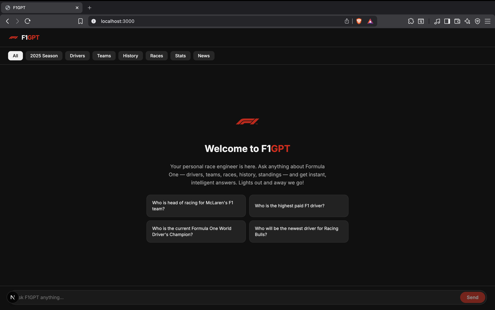

# 🏎️ F1GPT — Formula One RAG Chatbot

Your personal race engineer — powered by Retrieval-Augmented Generation (RAG), OpenAI, and Datastax Astra DB.
Ask anything about Formula One and get intelligent, up-to-date responses streamed in real time.



---

## What is This?

F1GPT is a **Retrieval-Augmented Generation chatbot** built for Formula One fans. It combines:

- **Vector Embeddings** — user queries are transformed into 1536-dimensional vectors using OpenAI `text-embedding-3-small`.
- **Astra DB (Datastax)** — stores scraped F1 content as vector documents and retrieves the most relevant chunks via `dot_product` similarity search.
- **OpenAI GPT-4o-mini** — generates high-quality, context-grounded answers using the retrieved documents.
- **Next.js 16 + Vercel AI SDK** — real-time streaming chat UI with a modern dark theme.

---

## How It Works

1. **User asks a question** via the chat interface.
2. The question is embedded using the OpenAI Embeddings API (`text-embedding-3-small`).
3. The embedding is sent to Astra DB to find the top 10 most relevant document chunks.
4. The retrieved context is injected into a system prompt.
5. GPT-4o-mini streams a response chunk by chunk.
6. The frontend displays the answer live as it arrives.

---

## Data Sources

The knowledge base is built by scraping and embedding content from:

- [Wikipedia — Formula One](https://en.wikipedia.org/wiki/Formula_One)
- [F1 Fandom Wiki](https://f1.fandom.com/wiki/Formula_1_Wiki)
- [Formula1.com (official site)](https://www.formula1.com/)
- [Wikipedia — World Drivers' Champions](https://en.wikipedia.org/wiki/List_of_Formula_One_World_Drivers%27_Champions)
- [MotorsportTickets — F1 Driver Salaries](https://motorsporttickets.com/blog/f1-driver-salaries-how-much-formula-1-drivers-earn/)
- [Formula1.com — 2025 Race Results](https://www.formula1.com/en/results/2025/races)
- [Wikipedia — Female F1 Drivers](https://en.wikipedia.org/wiki/List_of_female_Formula_One_drivers)
- [Formula1.com — Latest News](https://www.formula1.com/en/latest)

---

## Prerequisites

- **Node.js ≥ v20**
- An **OpenAI API key** (with billing enabled)
- A **Datastax Astra DB** instance and application token

---

## Installation & Setup

1. **Clone the repository**

```bash
git clone https://github.com/KartikGonde/Formula1_ChatBot.git
cd Formula1_ChatBot
```

2. **Install dependencies**

```bash
npm install
```

3. **Configure environment variables**

Create a `.env.local` file in the project root:

```
OPENAI_API_KEY=your-openai-api-key
ASTRA_DB_NAMESPACE=your-namespace
ASTRA_DB_COLLECTION=your-collection
ASTRA_DB_API_ENDPOINT=https://your-astra-endpoint
ASTRA_DB_APPLICATION_TOKEN=your-astra-token
```

4. **Seed the database**

```bash
npm run seed
```

5. **Start the development server**

```bash
npm run dev
```

Open [http://localhost:3000](http://localhost:3000) in your browser.

---

## Project Structure

```
app/
  api/chat/route.ts              # RAG API route (embeddings + Astra search + GPT streaming)
  components/
    Bubble.tsx                   # Chat message bubble
    LoadingBubble.tsx            # Typing indicator
    PromptSuggestionButton.tsx   # Clickable prompt card
    PromptSuggestionsRow.tsx     # 2-column prompt suggestions grid
  assests/                       # Logo and background images
  global.css                     # Dark-themed styles
  layout.tsx                     # Root layout
  page.tsx                       # Main chat interface
scripts/
  loadDb.ts                      # Web scraper + Astra DB seeding script
```

---

## Technologies Used

| Layer       | Technology                                    |
|-------------|-----------------------------------------------|
| Framework   | Next.js 16 (App Router, Turbopack)            |
| Frontend    | React 18, Vercel AI SDK (`@ai-sdk/react`)     |
| LLM         | OpenAI GPT-4o-mini                            |
| Embeddings  | OpenAI `text-embedding-3-small` (1536-dim)    |
| Vector DB   | Datastax Astra DB (dot_product similarity)    |
| Scraping    | Puppeteer + LangChain document loaders        |
| Styling     | Custom CSS (YouTube-inspired dark theme)      |
| Language    | TypeScript 5                                  |

---

## Acknowledgments

- [OpenAI](https://openai.com/) for GPT-4o-mini and Embeddings API
- [Datastax Astra DB](https://www.datastax.com/products/datastax-astra) for serverless vector storage
- [Vercel AI SDK](https://ai-sdk.dev/) for streaming chat primitives
- Formula One data from Wikipedia, Formula1.com, and community sources

---

Lights out and away we go! 🏁
